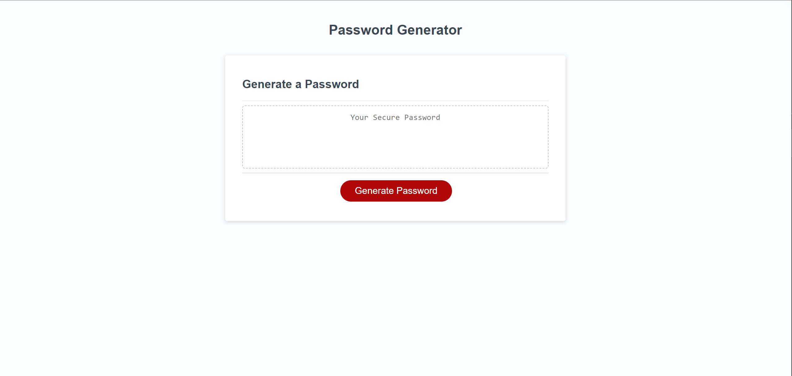

# Password Generator

This is a random password generator. I feel that I did well on this challenge but I can always improve.

## Table of Contents

- [About](#about)
- [Getting Started](#getting-started)
- [Usage](#usage)
- [Contributing](#contributing)
- [License](#license)

## About

The purpose of this project was to create a random passowrd generator. During this process, I learned the most js I ever have in just a few sittings. The website now features proper and concise code with no errors, and does as instructed.

## Getting Started

This section is not applicable as it's a description of the project's purpose and improvements.

## Usage

Press "Generate Password", then follow the stemps that are prompted.

## Contributing

This project was developed by [Charles Tiffany](https://github.com/charleswt/).

## Screenshot

## License

Please refer to the LICENSE file in the repository for details.   
  (./https://github.com/charleswt/challenge-3/blob/main/LICENSE)